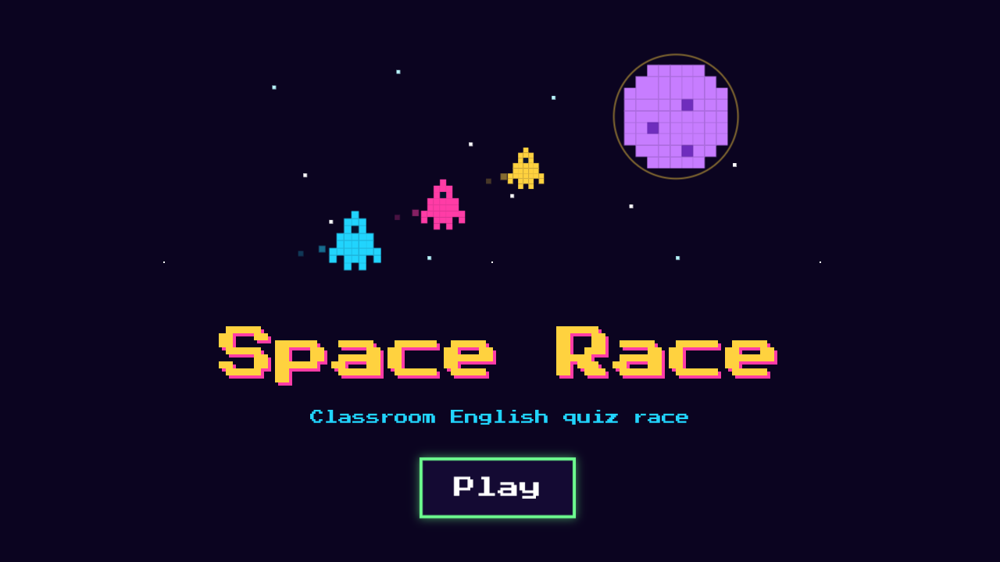
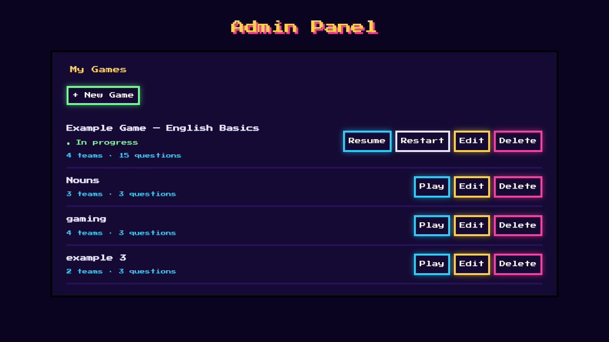
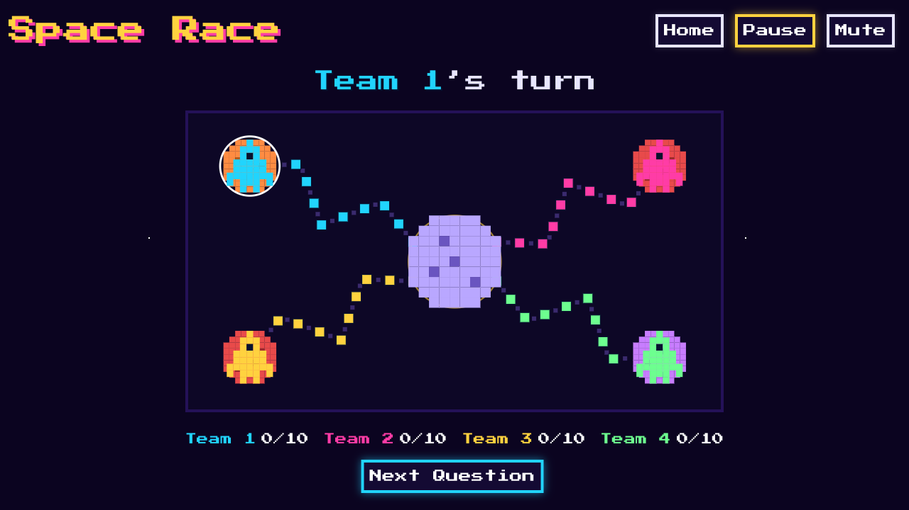
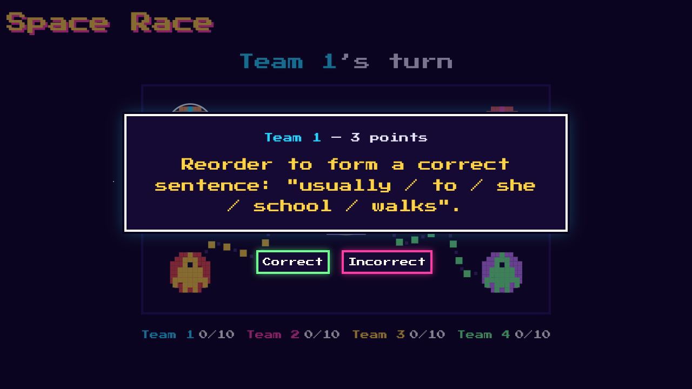

# Space Race — Teacher's Manual

A classroom English quiz race. You split the class into teams; each team has a
spaceship racing across a board. You show questions one at a time, the teams
answer out loud, and you mark each answer **Correct** or **Incorrect** — a
correct answer moves that team's ship forward. First ship to the finish wins.

**No internet needed.** Everything runs on your own computer. You don't install
Node.js, npm, or anything technical — you run **one program**.

---

## 1. Install (one time)

Download the file for your computer from the project's **Releases** page, then:

### Windows
1. Download **`space-race-win-x64.exe`**.
2. Double-click it. The first time, Windows may show a blue "Windows protected
   your PC" box — click **More info → Run anyway** (this happens because the
   program isn't signed; it is safe).

### macOS
1. Download **`space-race-macos-arm64`** for Apple-Silicon Macs (M1/M2/M3/M4),
   or **`space-race-macos-x64`** for older Intel Macs. *(If you're unsure: Apple
   menu → About This Mac → if it says "Apple M…", use arm64.)*
2. The first time you open it, macOS shows a warning like *"Apple could not
   verify … is free of malware."* This is normal for a program that isn't signed
   with a paid Apple Developer account — it is safe. Allow it once, either way:
   - **Easiest:** open **System Settings → Privacy & Security**, scroll to the
     message *"space-race-… was blocked"* and click **Open Anyway**, then open
     the program again and choose **Open**.
   - **Or in Terminal** (from the folder with the file), which also restores the
     run permission a download can strip:
     ```
     chmod +x space-race-macos-arm64
     xattr -d com.apple.quarantine space-race-macos-arm64
     ./space-race-macos-arm64
     ```
   You only do this once per download.

### Linux
1. Download **`space-race-linux-x64`**.
2. Make it runnable: right-click → Properties → check "Allow executing as
   program", **or** in a terminal: `chmod +x space-race-linux-x64`.
3. Double-click it (or run `./space-race-linux-x64`).

> 💡 Put the program in its own folder. When it runs it creates a file called
> **`space-race.db`** next to it — that's where your questions and games are
> saved (see §6).

---

## 2. Start the game

1. **Double-click the program.** A small black window opens that says
   *"Space Race is running…"* — **leave that window open** while you teach.
   Closing it stops the game.
2. Your web browser opens automatically to the **title screen**. If it doesn't
   open on its own, open your browser and go to **`http://localhost:3001`**.
3. Click **Play**.



---

## 3. Set up your questions (Admin Panel)

The **Play** button takes you to the **Admin Panel** — your control room. There's
already an **Example Game** to try. To make your own, click **+ New Game** and
follow the three steps:

1. **Game & rules** — name the game, choose how many spaces to win (3–10), and
   how many teams (2–4).
2. **Team names** — name each team.
3. **Questions** — add each question, its correct answer, and how many points it
   is worth (a correct answer moves the ship forward by that many spaces).

You can **Edit**, **Restart**, or **Delete** any game later. The game that's
currently being played shows an **"In progress"** label.



---

## 4. Run a game

1. In the Admin Panel, click **Play** on the game you want (or **Resume** to
   continue a game already in progress).
2. The **game board** appears — one home planet per team, a finish planet, and
   each team's ship. Project this screen for the class.



3. Click **Next Question**. The question appears in the middle of the screen,
   showing **whose turn it is** and **how many points** it's worth.
4. The team answers out loud. Click **Correct** or **Incorrect** (below the
   question). On **Correct**, that team's ship glides forward.
5. Repeat. The first ship to reach the finish planet wins — a winner banner
   appears.



**Controls on the board (top-right):**
- **Home** — go back to the Admin Panel.
- **Pause** — freeze the game (the board greys out; click **Resume** to continue).
- **Mute** — turn the sound effects on/off.

---

## 5. Project it, and let students join on phones (optional)

- **Projector:** open the game on the computer connected to the projector and
  show the **board**. That's all you need.
- **Phones/tablets (same Wi-Fi):** students can open the board on their own
  devices:
  1. On the teacher computer, find its address on the network:
     - **Windows:** open Command Prompt and type `ipconfig` — use the "IPv4
       Address" (looks like `192.168.x.x`).
     - **macOS:** System Settings → Wi-Fi → Details → IP address.
  2. On the phone (connected to the **same Wi-Fi**), open the browser and go to
     `http://<that-address>:3001` (for example `http://192.168.1.42:3001`).
  3. Optional: in the phone's browser menu, choose **"Add to Home Screen"** for a
     one-tap icon.

> If a phone can't connect, check both devices are on the same Wi-Fi, and allow
> the program through the computer's firewall if it asks.

---

## 6. Where your games are saved

All your questions and games live in **`space-race.db`**, the file created next
to the program. To **back up** your work or move it to another computer, copy
that file. To start completely fresh, close the program, delete `space-race.db`,
and start it again (it will recreate the Example Game).

---

## 7. Troubleshooting

| Problem | What to do |
|---|---|
| The browser didn't open by itself | Open your browser and go to `http://localhost:3001`. |
| "Windows protected your PC" / macOS "could not verify … malware" | See §1 — this is normal for an unsigned program. Windows: *More info → Run anyway*. macOS: *System Settings → Privacy & Security → Open Anyway* (or the Terminal `xattr` command in §1). |
| It says the port is already in use | Another copy is probably already running. Close the extra black window (or restart the computer) and open it once. |
| A phone can't reach the game | Make sure both are on the same Wi-Fi, use the correct `192.168.x.x` address, and allow the firewall prompt. |
| Nothing happens / I want to stop | Close the small black window — that stops the game. Your saved games are kept. |

---

*Space Race — TCU-658, Escuela de Lenguas Modernas, Universidad de Costa Rica.
Built for CTP de Guácimo (MEP Technical English program).*
